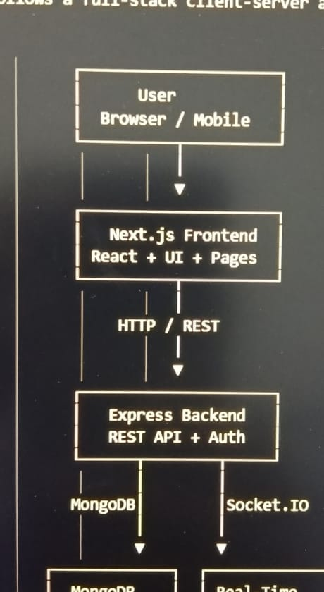

# TaskMatrix – Agile Project Management Platform

## Project Overview

TaskMatrix is an Agile Project Management Platform designed to help teams manage projects, tasks, sprints, and team collaboration from a single dashboard.

## Designated Track

**Option 3 – TaskMatrix (Agile Project Management)**

## Problem Statement

Teams often use multiple tools to manage tasks, sprints, progress, and project communication. TaskMatrix provides a centralized platform to simplify Agile project management.

## Target Users

- Project Managers
- Team Leads
- Developers
- Testers
- Project Members

## Technology Stack

- Frontend: Next.js / React
- Backend: Node.js / Express
- Database: MongoDB
- Authentication: JWT
- Styling: Tailwind CSS
- Real-time Communication: Socket.IO
- Deployment: Vercel

## Prioritized Core Features

### P0 – Mandatory MVP

- Project dashboard
- Task creation and deletion
- Task status management
- Kanban-style task board
- Sprint management
- Responsive UI

### P1 – Priority Features

- User authentication
- Project creation and management
- Team member management
- Task editing
- Search and filtering
- UI/UX wireframes

### UI/UX Wireframes

[Figma Wireframe – TaskMatrix](https://www.figma.com/design/EJGcLpNuCcQDVuQveUNvsD/sprint13-TaskMatrix-Wireframes?t=ysYAyLvCFw1KTYVi-1)

### System Architecture

### P2 – Stretch Features

- Real-time task updates
- Notifications
- Activity tracking
- Analytics
- Full-stack architecture
- Database architecture and ERD

## Development Plan

1. Requirements and PRD
2. UI/UX Wireframes
3. System Architecture
4. Database Design
5. MVP Development
6. Testing
7. Deployment
8. Documentation

## Sprint 13 Goal

Build a functional Agile Project Management Platform with the mandatory MVP features and supporting documentation, architecture diagrams, wireframes, and project demo.

## Project Status

Sprint 13 – Capstone Planning and MVP Development